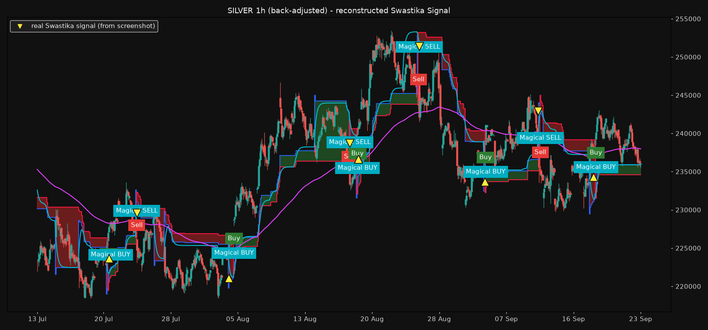

# Swastika Signal: real vs rebuild, backtest, and fixes

**Data:** MCX near-month futures, 1-minute bars, 1 Jan 2025 – 23 Sep 2026.
Rolls are back-adjusted (like TradingView B-ADJ), signals run on 1h bars from 09:00.
**Execution:** signal on bar close → fill at the next bar's open. Costs per round trip are
0.02% of notional + 5 ticks slippage per side, plus one extra round trip per roll held.
All ₹ figures are **net**.

## 1. Real indicator vs rebuild

The user's screenshot shows 9 real Buy/Sell labels on SILVER1! 1h between 21 Jul and
17 Sep 2026. I read their times off the chart (about ±3 bars of reading error) and
searched the band settings for the closest match (`research/calibrate.py`).

| Band settings | Labels in that window | Real labels matched (±8 bars) |
|---|---:|---:|
| My first guess: ATR 10, ×2 / ×3 | 28 | 5 of 9 |
| **Calibrated: ATR 20, ×5 / ×6** | **9** | **9 of 9, avg 1.9 bars off** |

The band settings were the problem. My first version flipped about 3× as often as the
real one, which is where the low win rate and huge drawdown in the first report came
from. Every setting with an outer multiplier of 6 (ATR 10–40) matched 9/9. The
inner/outer distances on the 1 Oct screenshot (3.3k / 4.0k from price, ratio 0.82)
also fit ×5 / ×6.

| Real label | Real (screenshot) | Rebuild | Bars off | Day row |
|---|---|---|---:|---|
| Buy | 21 Jul 12:00 | 21 Jul 11:00 | −1 | SELL |
| Sell | 23 Jul 18:00 | 23 Jul 18:00 | 0 | SELL |
| Buy | 04 Aug 17:00 | 05 Aug 09:00 | +7 (overnight) | SELL |
| Sell | 19 Aug 09:00 | 19 Aug 09:00 | 0 | SELL |
| Buy | 19 Aug 20:00 | 19 Aug 19:00 | −1 | SELL |
| Sell | 27 Aug 09:00 | 26 Aug 23:00 | −1 | SELL |
| Buy | 03 Sep 19:00 | 03 Sep 20:00 | +1 | SELL |
| Sell | 10 Sep 17:00 | 10 Sep 20:00 | +3 | SELL |
| Buy | 17 Sep 22:00 | 18 Sep 10:00 | +3 | SELL |

*Yellow triangles mark the real signals from the screenshot. Labels are the rebuild.*

**Not matched:**
* **Magical BUY/SELL.** The real one is rare: none on these 9 legs, one around 14 Jul,
  one around 24 Sep. Neither my cyan-trail rule nor any setting I tried reproduces
  that, so the rebuilt Magical is a guess and isn't used in the recommendation.
* **"Fake SELL"** (orange, 19 Aug). That Sell was reversed by a Buy 10 bars later.
  Nothing in the bands or table distinguishes it at the moment it printed (the
  23 Jul and 27 Aug Sells looked the same). So it is most likely **written on the
  chart afterwards**, once the reversal happened. A label like that can't be traded:
  at signal time it was just "Sell".

## 2. Backtest of the real Buy/Sell (calibrated settings)

1 lot (Silver 30 kg, Gold 1 kg):

| | Trades | Win % | Net P&L | Profit factor | Max drawdown | Worst losing streak |
|---|---:|---:|---:|---:|---:|---:|
| **Silver**, my first guess (×3) | 212 | 35.8 | ₹53.1 L | 1.37 | −₹45.2 L | — |
| **Silver**, real settings (×6) | 69 | 47.8 | ₹63.8 L | 1.91 | −₹15.4 L | 5 |
| **Gold**, my first guess (×3) | 194 | 37.1 | −₹2.9 L | 0.98 | −₹35.7 L | — |
| **Gold**, real settings (×6) | 59 | 52.5 | ₹95.6 L | 2.77 | −₹11.1 L | 4 |

The real settings already have about a 50% win rate and ⅓ of the drawdown of my first
version. They are also the stable middle of the parameter grid (`sensitivity.csv`):
on 1h, ×5–×6 is the best region for both metals. 15m and 4h are worse.

**In the screenshot window itself (20 Jul – 23 Sep) the real signals lost money:**
9 trades, 3 winners, **−₹3.2 L per Silver lot**. Silver ranged 220k–255k for two
months, and a band-flip system always bleeds in a range.

## 3. Fixing win rate and drawdown

Seven variants were fixed up front and tested on both metals, reading 2025 and 2026
separately (`research/improve.py`, minute-level stops). Sized at **₹20,000 risk per
trade** (Silver Micro 1 kg units, Gold in 10 g units), so drawdowns are comparable:

| Variant | Silver win % | Silver PF | Silver max DD | Gold win % | Gold PF | Gold max DD | Holds in both years? |
|---|---:|---:|---:|---:|---:|---:|---|
| V0 real Buy/Sell, always in | 48 | 1.97 | −₹62k | 52 | 3.11 | −₹64k | yes |
| **V1 only with the Day row** | **59** | **3.80** | **−₹43k** | **64** | **6.77** | **−₹31k** | **yes** |
| V2 fixed 3×ATR stop | 44 | 2.33 | −₹86k | 41 | 2.32 | −₹103k | no (Gold 2026 loses) |
| V3 band as intrabar trailing stop | 47 | 2.18 | −₹56k | 53 | 2.37 | −₹50k | yes, small gain on DD |
| V4 skip if ADX < 20 | 40 | 1.16 | −₹99k | 53 | 2.88 | −₹45k | no (Silver near breakeven) |
| V5 50% off at 1.5R, then breakeven | 54 | 2.16 | −₹73k | 53 | 1.98 | −₹106k | no (Gold 2026 loses) |
| C1 Day + stop + scale-out + trail | 59 | 3.72 | −₹55k | 64 | 3.78 | −₹46k | yes, weaker than V1 |

**V1 by year (1 lot):**

| | 2025 | 2026 (to 23 Sep) |
|---|---|---|
| Silver | 17 trades, 59% wins, PF 8.1, +₹27.0 L | 15 trades, 60% wins, PF 3.2, +₹31.0 L |
| Gold | 17 trades, 71% wins, PF 10.9, +₹40.4 L | 11 trades, 55% wins, PF 3.3, +₹30.9 L |

**What works:**
1. **Use the real settings (ATR 20, ×6), not faster ones.** This is the biggest single
   improvement.
2. **Only take Buy/Sell that agree with the Day row** (yesterday's daily band
   direction). Against-the-Day signals were mostly the whipsaws. Win rate rises
   ~50% → ~60%, drawdown falls 30–50%, and profit factor roughly doubles. It is the
   only rule that helped both metals in both years.
3. **Size by risk, not by lot.** Distance to the band × 30 kg meant one Silver lot
   risked about ₹0.9 L per trade in mid-2025, ₹6.2 L (median) in Q1 2026, and up to
   ₹22 L on the worst entry. Fixing the rupee risk per trade (lots = risk ÷ distance
   to the band) keeps a losing streak at a known size: V1's worst was −2.4R.

**What doesn't work:**
* **Tight stops and early profit-taking.** They raise the win rate on paper but cut
  the big winners that pay for everything. They failed on Gold in 2026.
* **ADX filter.**
* **Requiring all 6 table rows to agree.** That leaves only 3–6 trades in 21 months.

## 4. Caveats

* **Small sample:** V1 is 28–32 trades per metal. A win rate of 60% ± 9% is the
  honest range.
* **2025–26 was a strong trending period for both metals.** In a 2-month range like
  Jul–Sep 2026 even V1 lost (−₹2.9 L on Silver: 4 shorts, 1 winner).
* **Calibration used one Silver screenshot.** Gold is assumed to use the same
  settings.
* **The Day row is non-repainting here** (it uses the finished previous day). The live
  TradingView table updates during the day.
* **Rolls:** back-adjustment removes the overnight move on roll days.
  Near-month data stays on the expiring contract until expiry.
