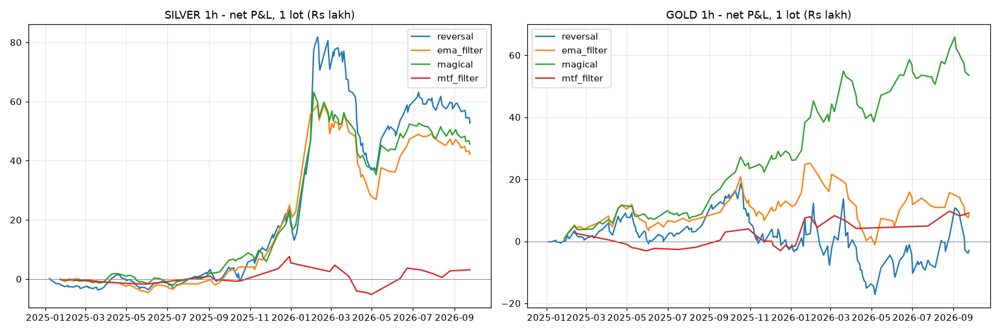

# Swastika Signal (reconstructed) — backtest on MCX Gold & Silver

**Data:** MCX near-month futures, 1-minute bars, 1 Jan 2025 – 23 Sep 2026 (447 sessions).
Contract rolls are difference back-adjusted (as TradingView's B-ADJ). Signals are
computed on 1h bars anchored at 09:00, matching the screenshot.

**Execution:** signal on bar close → fill at next bar's open. 1 lot (Silver 30 kg,
Gold 1 kg). Costs per round trip: 0.02% of notional + 5 ticks slippage per side
(≈ ₹1,700 Silver, ≈ ₹3,800 Gold), plus one extra round trip for every roll a
position is held through. All P&L below is **net, in ₹ per 1 lot**.

> The original indicator is closed-source. This is a reconstruction from how it
> draws (see `swastika/indicator.py`), so results describe *this logic*, not
> necessarily the paid script.

## Strategies tested

| Name | Rule |
|---|---|
| `reversal` | Buy label → go long, Sell label → go short. Always in the market. |
| `ema_filter` | Buy/Sell labels, but only take longs above the 200 EMA and shorts below it; otherwise flat. |
| `magical` | Enter on Magical BUY / Magical SELL; exit on the opposite Buy/Sell label. |
| `mtf_filter` | Buy/Sell labels, only when every row of the timeframe table (3m…Day) agrees. |

## Results, 1h, default settings (ATR 10, band ×2/×3, cyan ATR 14 ×5, EMA 200)

| Symbol | Strategy | Trades | Win % | Net P&L | Profit factor | Max drawdown | Longs | Shorts |
|---|---|---:|---:|---:|---:|---:|---:|---:|
| SILVER | reversal | 212 | 35.8 | ₹53.1 L | 1.37 | −₹45.2 L | +₹42.7 L | +₹10.3 L |
| SILVER | ema_filter | 115 | 38.3 | ₹42.5 L | 1.54 | −₹32.0 L | +₹53.2 L | −₹10.7 L |
| SILVER | magical | 129 | 41.1 | ₹45.6 L | 1.52 | −₹27.9 L | +₹44.6 L | +₹1.0 L |
| SILVER | mtf_filter | 27 | 37.0 | ₹3.1 L | 1.14 | −₹12.8 L | +₹7.1 L | −₹4.0 L |
| GOLD | reversal | 194 | 37.1 | −₹2.9 L | 0.98 | −₹35.7 L | +₹25.3 L | −₹28.3 L |
| GOLD | ema_filter | 99 | 43.4 | ₹8.5 L | 1.09 | −₹26.3 L | +₹40.2 L | −₹31.7 L |
| GOLD | magical | 108 | 48.1 | ₹53.5 L | 1.69 | −₹16.3 L | +₹60.3 L | −₹6.8 L |
| GOLD | mtf_filter | 32 | 46.9 | ₹9.1 L | 1.40 | −₹7.0 L | +₹18.7 L | −₹9.6 L |

Buy-and-hold 1 lot over the same period (rolled for free): Silver ₹32.9 L, Gold ₹54.3 L.

### By year

| Symbol | Strategy | 2025 net | PF | 2026 net (to 23 Sep) | PF |
|---|---|---:|---:|---:|---:|
| SILVER | reversal | ₹19.7 L | 1.54 | ₹33.4 L | 1.31 |
| SILVER | magical | ₹18.3 L | 1.86 | ₹27.3 L | 1.42 |
| GOLD | reversal | −₹2.7 L | 0.96 | −₹0.3 L | 1.00 |
| GOLD | magical | ₹28.3 L | 2.19 | ₹25.3 L | 1.47 |

## What the numbers say

1. **It's a trend follower: win rate 35–48%, profit comes from a few big trends.**
   Average win is 2–2.5× the average loss. On Silver the 5 biggest trades are
   more than 100% of the total profit.
2. **Silver's profit is mostly one move.** Of `reversal`'s ₹53 L, ₹37 L came in
   Dec 2025–Jan 2026, when silver went 172k → 420k and back to 229k. Outside
   those two months: `reversal` +₹15.7 L, `magical` +₹5.0 L, `ema_filter` −₹6.8 L.
3. **Shorts don't pay.** In a strong 2025–26 bull market for both metals, the
   short side lost money in 6 of 8 tests. Most of the edge is "be long when
   the trend is up".
4. **Magical is the best variant**: fewer trades, higher win rate, smaller
   drawdowns, and the only one that worked on Gold in both years.
5. **The full timeframe table as a filter is too strict.** The Day row blocks
   most signals (27–32 trades in 21 months) and the profit almost disappears.
6. **Drawdowns are large.** −₹28 L to −₹45 L per Silver lot, during the
   Feb–May 2026 chop, when silver swung ±10k a day and the bands flipped
   back and forth for 3 months.

## Robustness (`sensitivity.csv`)

Timeframe matters more than the exact settings:

| TF | Silver reversal | Silver magical | Gold reversal | Gold magical |
|---|---:|---:|---:|---:|
| 15m | ₹139.9 L (PF 1.68) | ₹86.3 L (1.61) | ₹86.4 L (1.31) | ₹81.5 L (1.49) |
| 30m | ₹40.5 L (1.23) | ₹52.9 L (1.56) | ₹81.7 L (1.46) | ₹49.4 L (1.40) |
| 1h | ₹53.1 L (1.37) | ₹45.6 L (1.52) | −₹2.9 L (0.98) | ₹53.5 L (1.69) |
| 2h | ₹69.2 L (1.80) | ₹57.4 L (2.65) | ₹89.3 L (2.11) | ₹58.6 L (2.00) |
| 4h | ₹67.9 L (2.26) | ₹38.6 L (2.16) | ₹75.4 L (2.44) | ₹45.6 L (2.00) |

On 1h, varying ATR length (10/14/20) and the band multiplier (2.0–4.0) gives
Silver ₹32 L–₹79 L (all profitable) and Gold −₹2.9 L–₹80.8 L. The default
1h/×3 setting happens to be Gold's worst cell, so a single setting's result
says little on its own. The general pattern (profitable in strong trends,
bleeding in chop) holds everywhere.

15m numbers are the least reliable: they carry 3× the costs, and with real
fills during fast moves slippage would be well above 5 ticks.

## Caveats

* **2025–26 was an exceptional bull market for precious metals.** A trend
  follower looks good in that regime; this sample has no long sideways or
  bear year. Don't extrapolate.
* **Back-adjustment hides overnight gaps at rolls.** The data has only one
  contract per day, so the roll gap mixes the calendar spread with the real
  overnight move (up to ~11k on Silver in 2026). Positions held over a roll
  miss that overnight move.
* **Near-month only.** The data stays on the expiring contract until expiry
  day, when it is thin. Real traders roll earlier.
* **The timeframe table is non-repainting here** (each row uses only finished
  bars). The live table on TradingView updates intrabar and will look more
  accurate in hindsight than it was in real time.
* **No position sizing or stops.** Results are per lot with no stop loss.
  Drawdowns here are several times the exchange margin for one lot, so real-world size must be much smaller.
